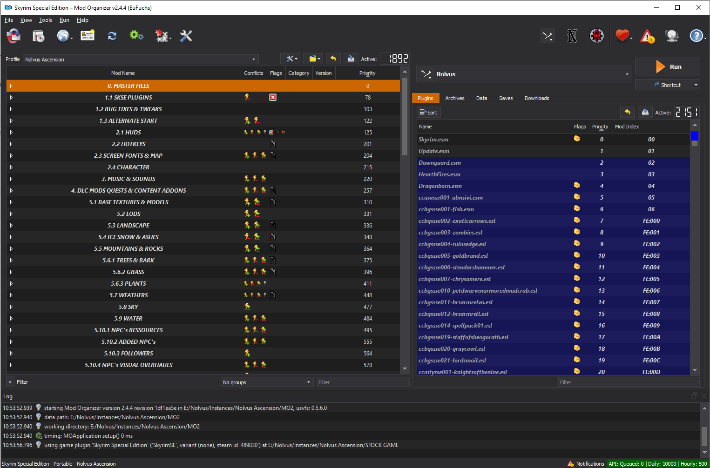
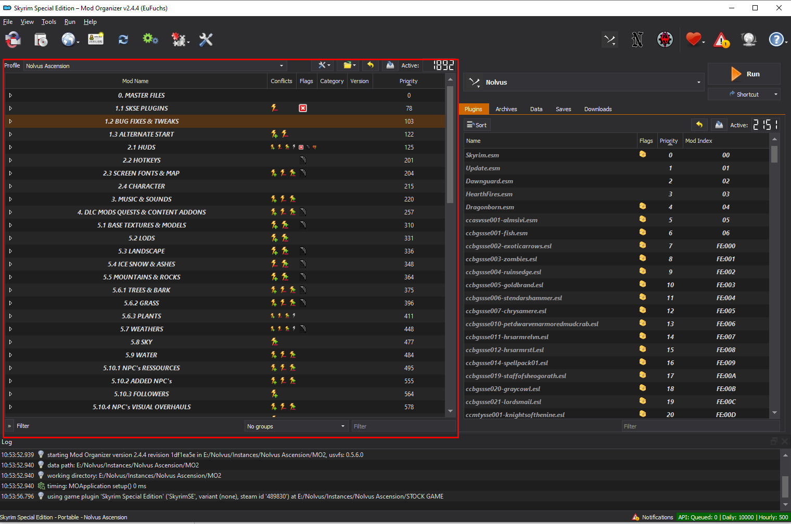
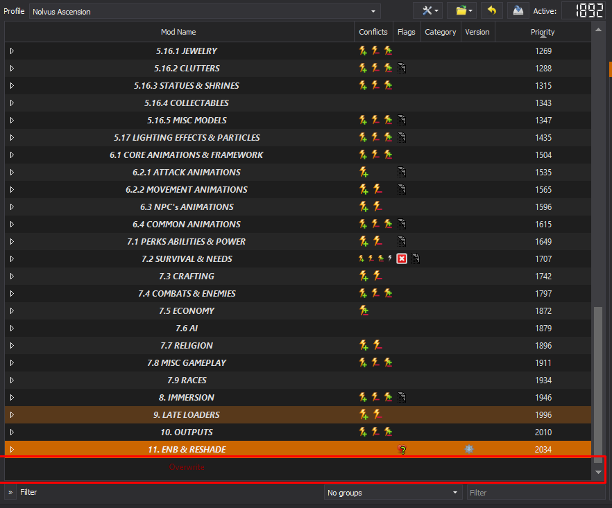
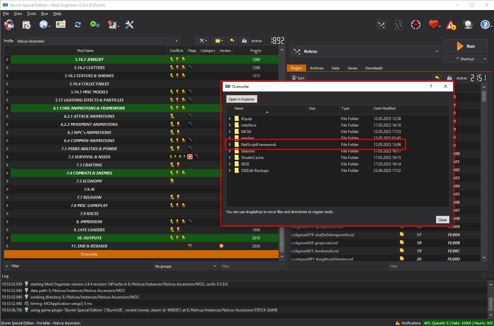
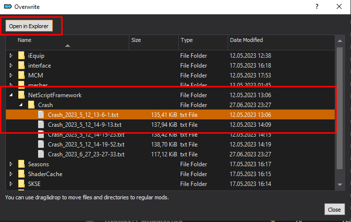
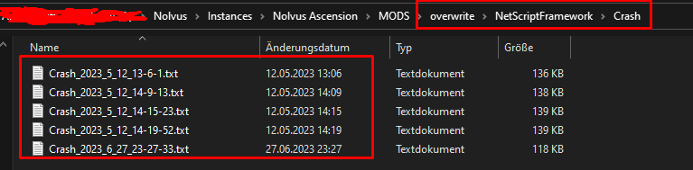

# Some commonly asked questions in the Nolvus Help channel on the discord
# This is only if you've not modified ANY part of the modlist

# end of guides (for now)

# Why can't I move when I start a new character?

**Order of operations is important here**, so you should follow only these steps (don't move, save, or try to do anything else in between):
1. Start the game, click New Character
2. You appear in the waiting room. Hit **Escape** and open `Skyrim Unbound` MCM
3. Load the `Nolvus Unbound` profile, and modify any other options if you wish
4. Click "`Let's Go!`"
5. Close MCM and you'll be taken to the character creator
6. Create and name your character
7. Click "`Stay Here`"
8. Wait for any remaining mod load messages to go away...
9. Press **Enter** key
10. Click "`Continue`"
11. Profit! (Once you load into your starting location, then you can save, configure mods, whatever you want from there.)

## Screen Zoomed in or cut off
This can happen if your Windows Scale is set higher than 100%. If you don't want to reduce it to 100% (affecting all applications), you can make an exception just for Skyrim: 
* Find `skse64_loader.exe` in the **x:\Nolvus\Instances\Nolvus Ascension\STOCK GAME** folder
* Right-click it, select **Properties**, click **Change high DPI settings**, and check the **Override** box. 
This excludes Skyrim from being affected by the Windows Scale setting.

# How do I start the main quest?
If you haven't read through the Player Guide (https://www.nolvus.net/guide/asc/appendix/playerguide) yet, you should do so now - it's got this and other very useful information.

**Starting the main quest **is determined by the Unbound settings you choose when you create your character. If you loaded the Nolvus Unbound profile, the default is to wait 7-21 in-game days and dragons will show up. Kill a dragon, absorb its soul, and the graybeards will call for you.

Note: Because there is currently no vanilla start option for Skyrim Unbound, you may also be wondering how to become Thane of Whiterun. This and other changes are detailed on the mod's description page, so check that out here:
https://www.nexusmods.com/skyrimspecialedition/mods/27962

# How Do I dodge? // how to change the dodge key

If you haven't read through the Player Guide (https://www.nolvus.net/guide/asc/appendix/playerguide) yet, you should do so now - it's got this and other very useful information.
* Nolvus uses **TK Dodge RE**, which is a script-free version of the TK Dodge mod (less lag). It also means there is no MCM for it.
* The default dodge key is **Left Shift**. To change it, you'll need to edit the appropriate ini file in MO2 (see the screenshot below).
* The website with the key/button codes can be found at https://wiki.nexusmods.com/index.php/DirectX_Scancodes_And_How_To_Use_Them
* If you're curious about setting up your controller, head to this handy thread: https://discord.com/channels/740569699900719145/1185271286067380414 (directs you to the novlus discord)

# How does alternate leveling work?

If you haven't read through the Player Guide (https://www.nolvus.net/guide/asc/appendix/playerguide) yet, you should do so now - it's got this and other very useful information!

If you choose Alternate Leveling when installing Nolvus, most skills* will not level up just by using them anymore. Instead you will accrue skill points and assign them yourself after leveling up. Here's how:
1. When you're notified of a level up, go to your skill tree and select Magicka/Health/Stamina as usual.
2. Find a bed and interact with it to lay in it.
3. Press T to rest; depending on your settings you may need to sleep for 8+ hours.
4. When you awake, you will be prompted to distribute your skill points accordingly - *but only if you did step 1 first!*
5. You can then return to your skill tree and select any new perks.

***Skills from custom skill trees (such as Unarmed) have their own unique rules, and may still level up through usage.***

# Why are my arrows so slow?

It can take a lot of getting used to, but yes arrows and other projectile speeds (including some magic) are decreased on purpose, to make them more dodge-able by you and your enemies.
### What mod is doing this?
 >This is from the mod **Action Based Projectiles**, which does not have config options. This does mean you will spend a lot less time sniping your enemies from a distance as an archer - you might get a shot or two off that way, but your bread-and-butter is going to come from **Bow Rapid Combo**. Lock on to your target and start using the alt-fire combos to rain death upon your foes! The same is true for magic casting - lock on and fire away. 
### Why do it this way?
 > Nolvus is clear about having very different combat than vanilla, and this is one of those ways for sure. I definitely understand how this particular change is jarring for those old-school archers and mages (it sure was for me!), but keep in mind Vektor balanced Nolvus gameplay and difficulty around the speeds from ABP, so try to embrace them.
### What about poise?
 >As for the poise mechanic, it's my understanding that the default configuration only has power attacks able to stagger opponents - I think there is a setting somewhere to allow light attacks to affect poise, but I forget where. But yes, you will definitely get perma-staggered if you don't timed-block or side-step in time, and that can be the end of your fight, Elden Ring style.

# How do I adjust font / widget sizes?

Most elements on the screen in Nolvus are managed by different mods, so adjusting sizes happens in multiple places:
* SkyUI has an MCM with a font size option (small/medium/large) that should handle most of the menus
* SkyHUD (Nordic UI) controls the subtitles; here's how to adjust them: 
 >Here since al lot of people have asked about how to change subtitle size:
 >1) Navigate to Nolvus/instances/nolvus acsension/mods/mods/nordic ui interface/interface/skyhud
 >2) Edit the skyhud.txt by changing the value next to fsubtitle to your liking (mine is set 1)
 >(Hope this gets pinned so others would find it)

* A Matter of Time controls the clock widget and text below it; you can adjust its size in that MCM
* Widget Mod controls the level / money / carry weight displays which can be adjusted in its MCM
* Better Third Person Selection controls the text of the stuff you interact with. You can modify Min and Max Widget sizes in the MCM to increase it
* iEquip controls the stuff on either side of the compass. It's harder to configure, so I created a Medium and Large preset for Nolvus (under Miscellaneous Files)
https://www.nexusmods.com/skyrimspecialedition/mods/108591

# How do I see undiscovered locations on the compass

To show undiscovered map markers in your Compass (disabled by default in Nolvus):
* Close Skyrim and go to MO2.
* Expand section **2.1 HUDS** and double-click on **Compass Navigation Overhaul**.
* Click on the INI Files tab and select the only file there.
* Change the value `bUndiscoveredLocationMarkers` from 0 to 1.
*NOTE: The on-screen quest log is also handled by this mod; to change its position or details, scroll down in this same file to the* `[QuestList]` *section.*

# How do I move the widgets in the upper left?

## Move the A Matter of Time widget to the right
 >Install this like a mod. When you load your game (or start a new one), go into the A Matter of Time MCM and Load Settings. Clock will move to the right.
 https://www.nexusmods.com/Core/Libs/Common/Widgets/DownloadPopUp?id=458562&game_id=1704

## Move the Widget Mod widgets to the right
 >Install this like a mod also. It just replaces the widget mod json file, and the gold/weight/level will be on the right without having to load any settings.
 https://www.nexusmods.com/Core/Libs/Common/Widgets/DownloadPopUp?id=458564&game_id=1704

# How do I reduce the equipment physics?

 Just install this settings file like any other mod in MO2 and make sure it loads after CBPC Equipment Physics (section 6.1)
 https://www.nexusmods.com/Core/Libs/Common/Widgets/DownloadPopUp?id=458567&game_id=1704

# How do I remove the limping animation

To remove the Underdog Animations injured player walks/idles:
*[Updated 2023-12-14]*

Open MO2 and expand section **6.4 COMMON ANIMATIONS**
Double-click on **Underdog Animations**
Go to the **Filetree** tab
Hide only these folders in MO2 and re-run Nemesis

# How do I reduce boob physics / jiggle

In MO2, expand section **5.10.1 NPC's RESOURCES**
Find the mod `CBPC - Physics with Collisions` and right-click it
Select **Reinstall Mod**
In the FOMOD:
Select `Skyrim Special Edition` and click **Next**
Select `SSE 1.5.97` (it's like the 7th option in the list) and click **Next**
Select `CBBE Curvy` body shape and click **Next**
Select `60 FPS` and click **Next**
Bounce Config: select `1 - Firmest` and click **Next**
Breast Amplitude: select `A Lot Reduced (30%)` (Nolvus default is "Normal")
Butt Amplitude: select `A Lot Reduced (30%)` (Nolvus default is "Normal")
Belly Amplitude: select `A Lot Reduced (30%)` (Nolvus default is "Normal")
Click **Next**
Do NOT select `Install Gravity Config`
Finally, click **Install**

# Where be me save games?

Check in your installer folder under Instances/Nolvus ascension/MODS/profiles/Nolvus Ascension/saves. WARNING!!! Your saves will not work if you reinstall the list using different options!!!

# Where are my character presets?

**Character presets** are stored in
`Overwrite\SKSE\Plugins\CharGen\Presets`
(Presets and head sculpts you make yourself will be in the **Overwrite **folder by default.)

# How do I make sure my saves don't get corrupted?

 >1. Never, **EVER** save in combat
 >2. when you die, **EXIT** the whole game (ALT+F4 that bitch), got to dashboard, start skyrim again, wait for the load, continue that way
 >3. Don't ever enable and or use autosaves
 >4. **DO NOT REMOVE OR ADD MODS MID-GAME**
 >5. Wait 30s after sleeping or entering a new zone before saving
 >7. Never save more than once per minute!

# How do I take a screenshot?

Shift windows(key) s is the built in screenshot tool
or use your steam screenshot key, or ALT+F1 for shadowplay

# How do I find a crash log?

1. Open ModOrganizer2 ( short MO2 ), by hitting play on the Nolvus Dashboard

2. Once MO2 has opened, you are greeted with this window:

If you've just been playing, this might already be opened of course

3. Head to the mods window, then scroll to the very bottom

4. Here you´ll find the MO2 Overwrite

5. Double click the Overwrite

This will bring up a new window, called Overwrite.
Inside you'll find all the files that get created while playing, like MCM settings and such, but most importantly, marked in red, the NetScriptFramework folder. This is where your Crashlogs are stored.

If you extend that folder you'll see the conveniently named Crash folder, and inside that folder is where you are headed.
To get there easily, simply hit the Open in Explorer button in the top left.

6. Hitting the button will bring you to the Overwrite folder inside your Nolvus install.
Now simply follow the path you explored inside the Overwrite window in MO2: Overwrite -> NetScriptFramework -> Crashes.

7. Now that you have found your Logs, head back to the #Help Channel on the Discord, and post your latest log with as much information as you can give.
This includes what you were doing when you crashed, where, and if you made any modifications to the list.